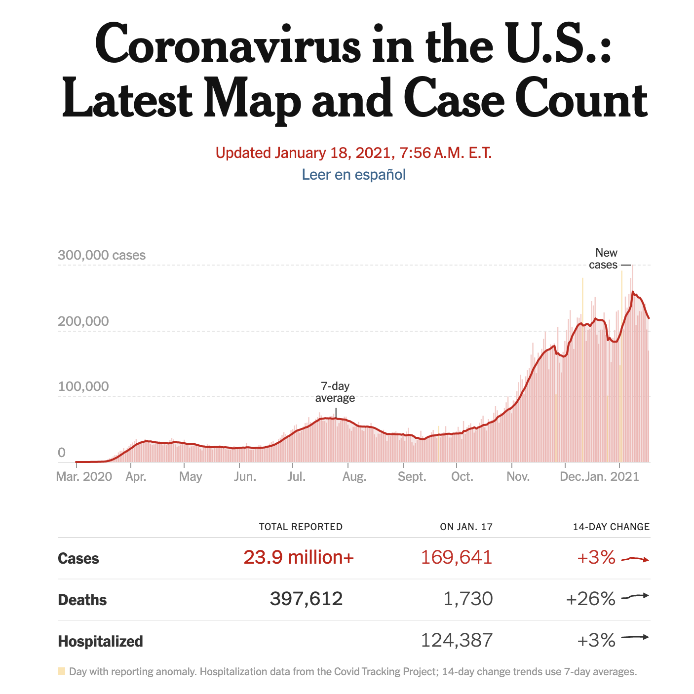

```{r setup, include=FALSE}
knitr::opts_chunk$set(echo = TRUE)
```

## Purpose
The purpose of this project is to reproduce one figure and two tables from the results of [New York Times](https://www.nytimes.com/interactive/2020/us/coronavirus-us-cases.html).

1. **Figure 1**: COVID-19 new cases and 7-day average in U.S. vs. date

2. **Table 1**: COVID-19 total cases, deaths and COVID-19 cases, deaths, and hospitalized data on 2021-01-17 with information about 14-day change in U.S.

3. **Table 2**: COVID-19 total cases and daily average in last 7 days from all U.S. states.


```{r, warning=FALSE, echo=FALSE, message=FALSE}
#load libraries
library(tidyverse)
library(lubridate)
library(zoo)
library(knitr)
```

### Figure 1:

```{r message=FALSE, warning=FALSE, echo=TRUE}
#import the data file
us_data <- read.csv("us-counties.csv")

#change the class of date column from character into date
us_data$date <- ymd(us_data$date)

#merge all data from different counties together
us_full_data <- us_data %>% 
  filter(!is.na(cases) & !is.na(deaths)) %>%
  group_by(date) %>% 
  summarise(cases = sum(cases),deaths = sum(deaths))

#add the new colunms of new cases and seven-day rolling average
new_us <- us_full_data %>%
  mutate(new_cases = cases - lag(cases)) %>%
  mutate(new_cases_7dayavg = rollmean(new_cases, k = 7, fill=NA, align = "right"))

#plot the figure with new cases as histogram and seven-day rolling average as curve
new_us %>% ggplot() +
  geom_bar(aes(date, new_cases),stat = "identity",width = 1) +
  geom_line(mapping = aes(x = date, y = new_us$new_cases_7dayavg), 
            size = 1, color = "blue") +
  geom_hline(yintercept = 100000, linetype = "dotted", col="grey") +
  geom_hline(yintercept = 200000, linetype = "dotted", col="grey") +
  geom_hline(yintercept = 300000, linetype = "dotted", col="grey") +
  annotate(geom="text", x = as.Date("2020-07-28"), y=80000, 
           label="7-day rolling average", color="blue") +
  annotate(geom="text", x = as.Date("2020-12-8"), y=280000, 
           label="New cases", color="black") +
  annotate(geom="text", x = as.Date("2020-03-05"), y=110000, 
           label="100,000 cases", color="grey") +
  annotate(geom="text", x = as.Date("2020-03-05"), y=210000, 
           label="200,000 cases", color="grey") +
  annotate(geom="text", x = as.Date("2020-03-05"), y=310000, 
           label="300,000 cases", color="grey") +
  ggtitle("Coronavirus in the U.S.: Lastest Map and Case Count") +
  xlab("Date") +
  ylab("")
```

#### Comparasion:
To better compare the results of this project to the orignal figure from New York Times, the original figure was provided below:

{ width=75% }

This figure is easy and clear to reproduce and the data set is well-labeled so that it was clear and convenient to regenerate the similar results.

### Table 1:

```{r message=FALSE, warning=FALSE, echo=TRUE}
#data for cases
us_cases_data <- us_data %>% 
  filter(!is.na(cases)) %>%
  group_by(date) %>% 
  summarise(cases = sum(cases)) %>% 
  mutate(new_cases = cases - lag(cases)) %>%
  mutate(new_cases_7dayavg = rollmean(new_cases, k = 7, fill=NA, align = "right")) %>%
  mutate("14-day change" = 100*(round((new_cases_7dayavg - lag(new_cases_7dayavg, n = 14))/lag(new_cases_7dayavg, n = 14),digit = 2)))

#data for death
us_death_data <- us_data %>% 
  filter(!is.na(deaths)) %>%
  group_by(date) %>% 
  summarise(deaths = sum(deaths)) %>% 
  mutate(deaths_increased = deaths - lag(deaths)) %>%
  mutate(new_deaths_7dayavg = rollmean(deaths_increased, k = 7, fill=NA, align = "right")) %>%
  mutate("14-day change" = 100*(round((new_deaths_7dayavg - lag(new_deaths_7dayavg, n = 14))/lag(new_deaths_7dayavg, n = 14), digit = 2)))

#data for hospitalization
us_hospitalized <- read.csv("all-states-history.csv")
us_hospitalized_data <- us_hospitalized %>% 
  filter(!is.na(hospitalizedCurrently)) %>%
  group_by(date) %>% 
  summarise(hospitalizedCurrently = sum(hospitalizedCurrently)) %>% 
  mutate(hospitalizedCurrently_7dayavg = rollmean(hospitalizedCurrently, k = 7, fill=NA, align = "right")) %>%
  mutate("14-day change" = 100*(round((hospitalizedCurrently_7dayavg - lag(hospitalizedCurrently_7dayavg, n = 14))/lag(hospitalizedCurrently_7dayavg, n = 14), digit = 2)))

#Pick the data on January 17th, 2021
Jan_cases_data <- us_cases_data %>% filter(date == as.Date("2021-01-17")) %>%
  select(cases,new_cases,`14-day change`)
Jan_deaths_data <- us_death_data %>% filter(date == as.Date("2021-01-17")) %>%
  select(deaths,deaths_increased,`14-day change`)
Jan_hospitalized_data <- us_hospitalized_data %>% filter(date == as.Date("2021-01-17")) %>%
  select(hospitalizedCurrently,`14-day change`)

#Print table
table1 <- 
  data.frame("Total Reported" = c(Jan_cases_data$cases, Jan_deaths_data$deaths, ""),
              "On Jan, 17" = c(Jan_cases_data$new_cases, Jan_deaths_data$deaths_increased, Jan_hospitalized_data$hospitalizedCurrently), 
              "14-Day Change" = c(Jan_cases_data$`14-day change`, Jan_deaths_data$`14-day change`, Jan_hospitalized_data$`14-day change`))
rownames(table1) <- c("Cases", "Deaths", "Hospitalized")
kable(table1, booktabs = TRUE, digits = 2, 
      col.names = c("Total Reported", "On Jan 17", "14-Day Change"))
```

#### Comparasion:
To better compare the results of this project to the original figure from New York Times, the original table was provided below:

{ width=75% }

This table is generated by two data sets and the illustration of the 14-day change is not very clear; more specifically, people did not know how to calculate this value based on the 7-day average. Moreover, the "hospitalized" row is actually the information of the patients that currently hospitalized, which made the reproduction of the results confusing. However, the data sets and labels were clear and easy to understand.

### Table 2:

```{r message=FALSE, warning=FALSE, echo=TRUE}
#merge the data from all counties from each state together on January 17th, 2021
us_state_data <- us_data %>% 
  filter(!is.na(cases)) %>%
  group_by(state,date) %>%
  summarise(cases = sum(cases)) %>%
  mutate(new_cases = cases - lag(cases)) %>%
  mutate(new_cases_7dayavg = round(rollmean(new_cases, k = 7, fill=NA, align = "right"), digits = 0)) %>%
  filter(date == as.Date("2021-01-17"))
head(us_state_data)
```

#### Comparison:
for better comparison with the original table, the same states were picked below:

```{r}
us_state_data_comparison <- us_state_data %>% 
  filter(state %in% c("Arizona", "California","South Carolina",
                      "Rhode Island", "Oklahoma", "Georgia",
                      "Utah", "Texas", "New York", "Massachusetts")) %>%
  select(state,cases, new_cases_7dayavg)
kable(us_state_data_comparison, booktabs = TRUE, col.names = c("State", "Total Cases", "Daily Avg.in Last 7 Days"))
```

And the orginal table is provided below:

{ width=75% }

This table is easy and clear to reproduce and the data set is well-labeled so that it was clear and convenient to regenerate the similar results. However, we only reproduced part of the table, except the per 100,000 or per capita columns.

